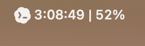
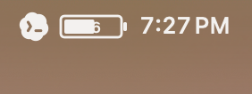

# Codex Usage Menu Bar

Small macOS menu-bar utility that shows the latest Codex 5h usage-limit percentage next to the clock.

<p>
  
  
</p>

It reads local Codex session events from `~/.codex/sessions`. No network call or API key is used.

Click the menu-bar item to choose:

- Percentage or battery display.
- Reset clock time or a live countdown to reset.

Codex usage logs are polled every 5 minutes. Countdown mode updates locally every second.

## Run

```sh
./scripts/build.sh
./.build/release/CodexUsageMenuBar
```

## Test the Reader

```sh
python3 scripts/read_codex_usage.py
```

## Start at Login

After building, install the included LaunchAgent:

```sh
./scripts/install_launch_agent.sh
```

Uninstall it with:

```sh
./scripts/uninstall_launch_agent.sh
```
